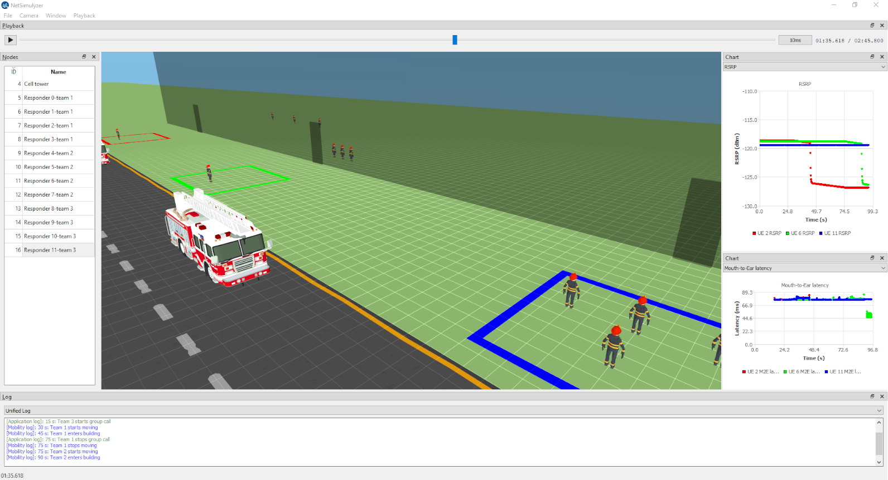

# NetSimulyzer
A flexible 3D visualizer for displaying, debugging, presenting, and understanding *ns-3* scenarios.




## Requirements

* A C++ 17 compliant compiler
  * Minimum supported compilers:
    * GCC 7.3.0
    * Clang 6.0.0
* CMake 3.13 or greater
* A graphics card supporting OpenGL 3.3
* Qt 5.12
* Optional: Doxygen

## Initial Setup

### Cloning
Clone the repository _recursively_ to collect the dependencies as well as the source

```shell
git clone --recursive {your ssh/https link}
```

Note: If you already cloned the project the normal way
You may pull the dependencies by running

```shell
git submodule update --recursive
```

### Building
Move into the project's root directory, and make a new directory called `build` and cd into it
```shell
mkdir build
cd build
```

#### CMake Options
To configure the build, any of the below may be passed to CMake with `-D` in the form `cmake -DNAME=VALUE`.

All of the following are optional

* `ENABLE_DOXYGEN`: Default `False`, set to `True` to build the API docs to the `doxygen/` directory in the build directory

##### Running CMake

Run `cmake` and specify the source directory, build type, and and desired build options from above. Then run the build tool.
```shell
cmake -DCMAKE_BUILD_TYPE=Release ..
cmake --build . --parallel
```

### Running
After building the application may launched from the project root directory with the following command:
```shell
cd ../
./build/netsimulyzer
```

## Resources

### Supported Model Formats
For the list of supported formats, see the [assimp wiki](https://github.com/assimp/assimp#supported-file-formats)

### Supported Texture Formats
Anything supported by [QImage](https://doc.qt.io/qt-5/qimage.html) should work.
Some more exotic formats may undergo conversion at load time.
Build in debug mode to check compatibility

### Resource Paths
When the Visualizer is first launched it well search the directory the application is
in and the current working directory for the `resources/` directory.
If that fails, the Visualizer will prompt for the location of the `resources/` directory.

By default the Visualizer will search from the `resources/` directory the following:

Models should have the path to the model relative to the root of the resources directory
(e.g. `models/fallback.obj`)

Textures will be searched for recursively in the `resources/` directory, and _must have unique names_.
If two textures have the same name, it is undefined which one will be selected.

All searches for textures in models will follow the texture rules above.

#### Non-distributable Resources

To add the models not available for public release into the project `cd` into the `resources/`
directory and clone the
['Visualization Resources Non-Distributable'](https://gitlab.nist.gov/wnd-publicsafety/visualization-resources_non-distributable)
project.

```shell
# From the project root
cd resources/

# Substitute with HTTPS if you prefer
# clones into a new directory 'extras/' for convenience
git clone git@gitlab.nist.gov:wnd-publicsafety/visualization-resources_non-distributable.git extras
```

The models may be referenced like so: `extras/models/props/Smartphone.obj`

## Controls

### Camera
The camera may be rotated by clicking and holding the left mouse button on the scene.

The camera may be moved by horizontally with `W`, `A`, `S`, & `D`,
 vertically with `Z`, & `X` and turned with the `Q`, & `E` keys

`W`: Forward

`A`: Left

`S`: Backward

`D`: Right

`Q`: Turn Left

`E`: Turn Right

`Z`: Up

`X`: Down

The camera controls may be changed from the 'Camera Settings' option in the 'Camera' menu

### Playback
The simulation starts in a paused state, the scene will still render, but time will not advance until it is unpaused.

`P`: Pause/Resume scenario playback.

### Chart
`Left Mouse` + Move: Move the chart view

`+` or `=`: Zoom In

`-`: Zoom Out

`R`: Reset Zoom

`Arrow Keys`: Scroll Chart

Currently, these keys cannot be configured.
